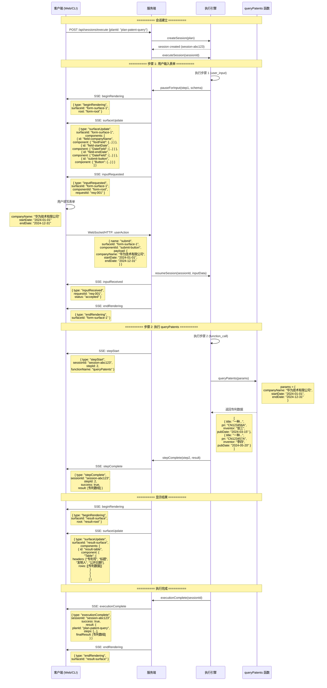

# A2UI 协议时序图 - 专利查询流程

## 概述

本文档描述了使用 A2UI 协议实现专利查询功能的完整数据流程，包括 Server 和 Client 之间的交互过程。

## 时序图



## 详细数据流说明

### 1. 会话建立阶段

**Client → Server**
```http
POST /api/sessions/execute
Content-Type: application/json

{
  "planId": "plan-patent-query",
  "platform": "web"
}
```

**Server → Client**
```json
{
  "sessionId": "session-abc123",
  "status": "running"
}
```

### 2. 步骤 1: 用户输入 (user_input)

#### 2.1 服务端初始化表单渲染

**Server → Client (SSE)**
```json
{
  "type": "beginRendering",
  "surfaceId": "form-surface-1",
  "root": "form-root"
}
```

#### 2.2 服务端发送表单组件

**Server → Client (SSE)**
```json
{
  "type": "surfaceUpdate",
  "surfaceId": "form-surface-1",
  "components": [
    {
      "id": "form-root",
      "component": {
        "Column": {
          "children": ["heading-1", "field-companyName", "field-startDate", "field-endDate", "submit-button"],
          "gap": 16
        }
      }
    },
    {
      "id": "heading-1",
      "component": {
        "Text": {
          "text": "专利查询参数",
          "style": "heading"
        }
      }
    },
    {
      "id": "field-companyName",
      "component": {
        "TextField": {
          "label": "公司名称",
          "name": "companyName",
          "placeholder": "例如：华为技术有限公司",
          "required": true
        }
      }
    },
    {
      "id": "field-startDate",
      "component": {
        "DateField": {
          "label": "开始日期",
          "name": "startDate",
          "maxDate": "2026-12-31"
        }
      }
    },
    {
      "id": "field-endDate",
      "component": {
        "DateField": {
          "label": "截止日期",
          "name": "endDate",
          "maxDate": "2026-12-31"
        }
      }
    },
    {
      "id": "submit-button",
      "component": {
        "Button": {
          "label": "查询专利",
          "action": "submit",
          "variant": "primary"
        }
      }
    }
  ]
}
```

#### 2.3 服务端请求用户输入

**Server → Client (SSE)**
```json
{
  "type": "inputRequested",
  "surfaceId": "form-surface-1",
  "componentId": "form-root",
  "requestId": "req-001"
}
```

#### 2.4 用户提交表单

**Client → Server (WebSocket/HTTP)**
```json
{
  "name": "submit",
  "surfaceId": "form-surface-1",
  "componentId": "submit-button",
  "payload": {
    "companyName": "华为技术有限公司",
    "startDate": "2024-01-01",
    "endDate": "2024-12-31"
  }
}
```

#### 2.5 服务端确认收到输入

**Server → Client (SSE)**
```json
{
  "type": "inputReceived",
  "requestId": "req-001",
  "status": "accepted"
}
```

**Server → Client (SSE)**
```json
{
  "type": "endRendering",
  "surfaceId": "form-surface-1"
}
```

### 3. 步骤 2: 执行 queryPatents 函数

#### 3.1 服务端通知步骤开始

**Server → Client (SSE)**
```json
{
  "type": "stepStart",
  "sessionId": "session-abc123",
  "stepId": 2,
  "functionName": "queryPatents",
  "parameters": {
    "companyName": "华为技术有限公司",
    "startDate": "2024-01-01",
    "endDate": "2024-12-31"
  }
}
```

#### 3.2 函数执行并返回结果

**queryPatents 函数返回**
```json
[
  {
    "title": "一种基于人工智能的图像识别方法",
    "pn": "CN123456A",
    "inventor": "张三、李四",
    "pubDate": "2024-03-15"
  },
  {
    "title": "一种5G通信系统中的信号处理装置",
    "pn": "CN123457A",
    "inventor": "王五、赵六",
    "pubDate": "2024-05-20"
  },
  {
    "title": "一种电池管理系统及方法",
    "pn": "CN123458A",
    "inventor": "孙七",
    "pubDate": "2024-08-10"
  }
]
```

#### 3.3 服务端通知步骤完成

**Server → Client (SSE)**
```json
{
  "type": "stepComplete",
  "sessionId": "session-abc123",
  "stepId": 2,
  "success": true,
  "result": [
    {
      "title": "一种基于人工智能的图像识别方法",
      "pn": "CN123456A",
      "inventor": "张三、李四",
      "pubDate": "2024-03-15"
    },
    {
      "title": "一种5G通信系统中的信号处理装置",
      "pn": "CN123457A",
      "inventor": "王五、赵六",
      "pubDate": "2024-05-20"
    },
    {
      "title": "一种电池管理系统及方法",
      "pn": "CN123458A",
      "inventor": "孙七",
      "pubDate": "2024-08-10"
    }
  ]
}
```

### 4. 结果显示阶段

#### 4.1 服务端初始化结果渲染

**Server → Client (SSE)**
```json
{
  "type": "beginRendering",
  "surfaceId": "result-surface",
  "root": "result-root"
}
```

#### 4.2 服务端发送结果表格组件

**Server → Client (SSE)**
```json
{
  "type": "surfaceUpdate",
  "surfaceId": "result-surface",
  "components": [
    {
      "id": "result-root",
      "component": {
        "Column": {
          "children": ["success-badge", "result-heading", "result-table"],
          "gap": 16
        }
      }
    },
    {
      "id": "success-badge",
      "component": {
        "Badge": {
          "text": "✅ 查询成功",
          "variant": "success"
        }
      }
    },
    {
      "id": "result-heading",
      "component": {
        "Text": {
          "text": "查询结果：共找到 3 条专利记录",
          "style": "heading"
        }
      }
    },
    {
      "id": "result-table",
      "component": {
        "Table": {
          "headers": ["专利号", "标题", "发明人", "公开日期"],
          "rows": [
            ["CN123456A", "一种基于人工智能的图像识别方法", "张三、李四", "2024-03-15"],
            ["CN123457A", "一种5G通信系统中的信号处理装置", "王五、赵六", "2024-05-20"],
            ["CN123458A", "一种电池管理系统及方法", "孙七", "2024-08-10"]
          ]
        }
      }
    }
  ]
}
```

### 5. 执行完成阶段

**Server → Client (SSE)**
```json
{
  "type": "executionComplete",
  "sessionId": "session-abc123",
  "success": true,
  "result": {
    "planId": "plan-patent-query",
    "steps": [
      {
        "stepId": 1,
        "type": "user_input",
        "success": true,
        "result": {
          "companyName": "华为技术有限公司",
          "startDate": "2024-01-01",
          "endDate": "2024-12-31"
        }
      },
      {
        "stepId": 2,
        "type": "function_call",
        "success": true,
        "result": [
          {
            "title": "一种基于人工智能的图像识别方法",
            "pn": "CN123456A",
            "inventor": "张三、李四",
            "pubDate": "2024-03-15"
          },
          {
            "title": "一种5G通信系统中的信号处理装置",
            "pn": "CN123457A",
            "inventor": "王五、赵六",
            "pubDate": "2024-05-20"
          },
          {
            "title": "一种电池管理系统及方法",
            "pn": "CN123458A",
            "inventor": "孙七",
            "pubDate": "2024-08-10"
          }
        ]
      }
    ],
    "finalResult": [
      {
        "title": "一种基于人工智能的图像识别方法",
        "pn": "CN123456A",
        "inventor": "张三、李四",
        "pubDate": "2024-03-15"
      },
      {
        "title": "一种5G通信系统中的信号处理装置",
        "pn": "CN123457A",
        "inventor": "王五、赵六",
        "pubDate": "2024-05-20"
      },
      {
        "title": "一种电池管理系统及方法",
        "pn": "CN123458A",
        "inventor": "孙七",
        "pubDate": "2024-08-10"
      }
    ]
  }
}
```

**Server → Client (SSE)**
```json
{
  "type": "endRendering",
  "surfaceId": "result-surface"
}
```

## A2UI 协议关键特性

### 1. 数据流模式（Data Flow Mode）

根据 [A2UI v0.8 规范](https://a2ui.org/specification/v0.8-a2ui/#14-data-flow-mode)，本示例采用 **Server-Driven** 模式：

- **Server 控制**：服务端完全控制 UI 渲染和数据流
- **Client 响应**：客户端响应用户操作并发送事件到服务端
- **单向数据流**：Server → Client (渲染指令), Client → Server (用户操作)

### 2. 消息类型说明

| 消息类型 | 方向 | 用途 |
|---------|------|------|
| `beginRendering` | Server → Client | 初始化新的渲染表面 |
| `surfaceUpdate` | Server → Client | 更新表面上的组件 |
| `inputRequested` | Server → Client | 请求用户输入 |
| `inputReceived` | Server → Client | 确认收到用户输入 |
| `endRendering` | Server → Client | 结束渲染并清理 |
| `userAction` | Client → Server | 用户操作事件（点击、提交等） |
| `stepStart` | Server → Client | 执行步骤开始 |
| `stepComplete` | Server → Client | 执行步骤完成 |
| `executionComplete` | Server → Client | 整个计划执行完成 |

### 3. 组件组合策略

A2UI 使用 **Flat Adjacency List** 模型：

- 每个组件有唯一 ID
- 父组件通过 `children` 数组引用子组件 ID
- 所有组件在 `components` 数组中扁平化存储

示例：
```json
{
  "id": "parent",
  "component": {
    "Column": {
      "children": ["child-1", "child-2"]
    }
  }
}
```

### 4. 状态管理

- **服务端持有状态**：session、执行上下文、步骤结果
- **客户端无状态**：只负责渲染和捕获用户操作
- **会话 ID 追踪**：所有消息携带 `sessionId` 或 `surfaceId`

## 实现要点

### 1. 执行引擎集成

```typescript
// 当执行到 user_input 步骤时
if (step.type === 'user_input') {
  // 暂停执行，设置 pendingInput
  session.status = 'waiting_input';
  session.pendingInput = {
    stepId: step.stepId,
    schema: step.schema,
    requestedAt: new Date().toISOString()
  };

  // 发送 inputRequested 消息
  sendA2UIMessage({
    type: 'inputRequested',
    surfaceId: `form-${session.id}`,
    componentId: 'form-root',
    requestId: `req-${step.stepId}`
  });

  // 等待用户输入
  await waitForUserInput(session.id);
}
```

### 2. 用户输入处理

```typescript
// 收到用户提交的表单数据
async function handleUserAction(action: A2UIUserAction) {
  const session = await sessionManager.loadSession(sessionId);

  if (session.status === 'waiting_input') {
    // 恢复执行
    await sessionManager.resumeSession(
      session.id,
      action.payload // 表单数据
    );

    // 发送确认消息
    sendA2UIMessage({
      type: 'inputReceived',
      requestId: action.payload.requestId,
      status: 'accepted'
    });
  }
}
```

### 3. 结果渲染

```typescript
// 执行完成后渲染结果
function renderResult(result: any[]) {
  sendA2UIMessage({
    type: 'beginRendering',
    surfaceId: 'result-surface',
    root: 'result-root'
  });

  sendA2UIMessage({
    type: 'surfaceUpdate',
    surfaceId: 'result-surface',
    components: buildResultComponents(result)
  });
}
```

## 参考资源

- [A2UI v0.8 Specification](https://a2ui.org/specification/v0.8-a2ui/)
- [A2UI Data Flow Mode](https://a2ui.org/specification/v0.8-a2ui/#14-data-flow-mode)
- [项目架构文档](./architecture.md)
