# fn-orchestrator 项目架构文档

> 最后更新时间：2026-01-08

## 📋 目录

- [项目概述](#项目概述)
- [架构图](#架构图)
- [核心模块详解](#核心模块详解)
- [数据流](#数据流)
- [设计模式](#设计模式)
- [SOLID 原则应用](#solid-原则应用)
- [测试覆盖率](#测试覆盖率)

---

## 项目概述

**fn-orchestrator** 是一个基于 LLM 的函数编排系统，能够将自然语言需求转换为可执行的函数调用链。

### 核心特性

- 🤖 **智能计划生成**：使用 Claude API 将自然语言转换为执行计划
- ▶️ **条件执行**：支持 if-else 条件分支和复杂流程控制
- 🔄 **会话管理**：支持执行会话的暂停、恢复、重试
- 🛠️ **函数自动补全**：检测缺失函数并自动生成 Mock 实现
- 📦 **多源函数**：支持本地函数和 MCP 服务器函数
- 🎨 **统一 UI**：A2UI 提供一致的 CLI 和 Web 界面
- 💾 **持久化存储**：计划、执行结果、会话状态持久化

### 技术栈

- **语言**：TypeScript
- **依赖注入**：InversifyJS
- **CLI 框架**：Commander.js
- **测试框架**：Vitest
- **LLM**：Anthropic Claude API
- **数据验证**：Zod

---

## 架构图

### 整体架构

```mermaid
graph TB
    %% ==================== CLI 层 ====================
    subgraph CLI["🖥️ CLI Layer (src/cli)"]
        CLI_Index["index.ts<br/>Commander 配置"]
        CLI_Plan["plan command<br/>生成执行计划"]
        CLI_Execute["execute command<br/>执行计划"]
        CLI_Refine["refine command<br/>改进计划"]
        CLI_Sessions["sessions command<br/>会话管理"]
        CLI_List["list command<br/>查看函数/计划"]
    end

    %% ==================== UI 层 ====================
    subgraph UI["🎨 UI Layer (src/a2ui)"]
        A2UI_Service["A2UIService<br/>统一 UI 服务"]
        A2UI_Renderer["A2UIRenderer<br/>渲染引擎"]
    end

    %% ==================== 服务层 ====================
    subgraph Services["⚙️ Service Layer (src/services)"]
        InteractivePlanService["InteractivePlanService<br/>交互式计划改进"]
        PlanRefinementSession["PlanRefinementSessionStorage<br/>改进会话存储"]
        PlanRefinementLLM["PlanRefinementLLMClient<br/>改进 LLM 客户端"]
    end

    %% ==================== 核心业务层 ====================
    subgraph Core["🎯 Core Business Layer"]

        %% Planner 模块
        subgraph Planner["📋 Planner (src/planner)"]
            Planner_Main["Planner<br/>计划生成器"]
            Planner_LLM["PlannerLLMClient<br/>LLM 适配器"]
            Planner_Anthropic["AnthropicPlannerLLMClient"]
            Planner_CLI["CLIPlannerLLMClient"]
        end

        %% Executor 模块
        subgraph Executor["▶️ Executor (src/executor)"]
            Executor_Conditional["ConditionalExecutor<br/>条件执行器"]
            Executor_Context["ExecutionContext<br/>执行上下文"]
            Executor_Timeout["TimeoutStrategy<br/>超时策略"]
        end

        %% 会话管理模块
        subgraph Session["🔄 Session Management (src/executor/session)"]
            Session_Manager["ExecutionSessionManager<br/>会话生命周期管理"]
            Session_Storage["ExecutionSessionStorage<br/>会话持久化"]
            Session_Types["ExecutionSession<br/>会话状态"]
        end

        %% 函数提供者模块
        subgraph FunctionProvider["📦 Function Provider (src/function-provider)"]
            FP_Composite["CompositeFunctionProvider<br/>组合提供者"]
            FP_Local["LocalFunctionProvider<br/>本地函数"]
            FP_MCP["MCPFunctionProvider<br/>MCP 服务器"]
        end
    end

    %% ==================== 函数补全系统 ====================
    subgraph FunctionCompletion["🤖 Function Completion System"]
        FC_Decorator["PlannerWithMockSupport<br/>装饰器模式"]
        FC_Orchestrator["CompletionOrchestrator<br/>补全编排器"]
        FC_Generator["FunctionCodeGenerator<br/>代码生成器"]
        FC_Validator["CodeValidator<br/>代码验证器"]
        FC_Loader["FunctionLoader<br/>动态加载器"]
        FC_Factory["MockServiceFactory<br/>工厂模式"]
        FC_LLM["LLMAdapter<br/>LLM 抽象层"]
    end

    %% ==================== 存储层 ====================
    subgraph Storage["💾 Storage Layer (src/storage)"]
        Storage_Main["Storage<br/>计划存储"]
        Storage_File["File System<br/>.data/plans/<br/>.data/executions/<br/>.data/sessions/"]
    end

    %% ==================== 配置层 ====================
    subgraph Config["⚙️ Configuration (src/config)"]
        ConfigManager["ConfigManager<br/>单例配置管理"]
        ConfigLoader["ConfigLoader<br/>配置加载器"]
        ConfigDefaults["defaults.ts<br/>默认配置"]
    end

    %% ==================== 依赖注入容器 ====================
    subgraph Container["📦 IoC Container (src/container)"]
        Container_Core["InversifyJS Container<br/>依赖注入"]
    end

    %% ==================== 工具层 ====================
    subgraph Utils["🛠️ Utilities"]
        Logger["Logger<br/>日志系统"]
        Validation["Validation<br/>数据验证 (Zod)"]
        Errors["Error Types<br/>自定义错误"]
    end

    %% ==================== 外部依赖 ====================
    subgraph External["🌐 External Dependencies"]
        Anthropic["Anthropic API<br/>Claude"]
        CLI_Tools["CLI Tools<br/>claude-switcher, gemini"]
        MCP_Server["MCP Server<br/>外部函数服务"]
    end

    %% ==================== 数据流 ====================
    %% CLI 层连接
    CLI_Index --> CLI_Plan
    CLI_Index --> CLI_Execute
    CLI_Index --> CLI_Refine
    CLI_Index --> CLI_Sessions
    CLI_Index --> CLI_List

    %% CLI 使用 UI
    CLI_Plan --> A2UI_Service
    CLI_Execute --> A2UI_Service
    CLI_Refine --> A2UI_Service
    CLI_Sessions --> A2UI_Service

    %% CLI 使用核心服务
    CLI_Plan --> Planner_Main
    CLI_Plan --> FC_Decorator
    CLI_Execute --> Session_Manager
    CLI_Refine --> InteractivePlanService
    CLI_Sessions --> Session_Manager

    %% Planner 流程
    Planner_Main --> Planner_LLM
    Planner_LLM --> Planner_Anthropic
    Planner_LLM --> Planner_CLI
    Planner_Anthropic --> Anthropic
    Planner_CLI --> CLI_Tools

    %% 函数补全流程
    FC_Decorator --> Planner_Main
    FC_Decorator --> FC_Orchestrator
    FC_Orchestrator --> FC_Generator
    FC_Orchestrator --> FC_Validator
    FC_Orchestrator --> FC_Loader
    FC_Generator --> FC_LLM
    FC_LLM --> Anthropic

    %% Executor 流程
    Session_Manager --> Executor_Conditional
    Session_Manager --> Session_Storage
    Executor_Conditional --> Executor_Context
    Executor_Conditional --> Executor_Timeout
    Executor_Conditional --> FP_Composite

    %% Function Provider 流程
    FP_Composite --> FP_Local
    FP_Composite --> FP_MCP
    FP_MCP --> MCP_Server

    %% 服务层流程
    InteractivePlanService --> PlanRefinementLLM
    InteractivePlanService --> PlanRefinementSession
    PlanRefinementLLM --> Anthropic

    %% 存储层连接
    Storage_Main --> Storage_File
    Session_Storage --> Storage_File
    PlanRefinementSession --> Storage_File

    %% 配置管理
    ConfigManager --> ConfigLoader
    ConfigLoader --> ConfigDefaults

    %% 容器管理所有依赖
    Container_Core -.绑定.-> Planner_Main
    Container_Core -.绑定.-> Executor_Conditional
    Container_Core -.绑定.-> Session_Manager
    Container_Core -.绑定.-> Storage_Main
    Container_Core -.绑定.-> FP_Composite
    Container_Core -.绑定.-> A2UI_Service
    Container_Core -.绑定.-> FC_Factory

    %% 工具层被广泛使用
    Logger -.日志.-> Planner_Main
    Logger -.日志.-> Executor_Conditional
    Logger -.日志.-> Session_Manager
    Validation -.验证.-> Planner_Main
    Validation -.验证.-> Storage_Main

    %% 样式定义
    classDef cliStyle fill:#e1f5ff,stroke:#0288d1,stroke-width:2px
    classDef coreStyle fill:#fff3e0,stroke:#f57c00,stroke-width:2px
    classDef storageStyle fill:#f3e5f5,stroke:#7b1fa2,stroke-width:2px
    classDef externalStyle fill:#e8f5e9,stroke:#388e3c,stroke-width:2px
    classDef utilStyle fill:#fce4ec,stroke:#c2185b,stroke-width:2px

    class CLI,CLI_Index,CLI_Plan,CLI_Execute,CLI_Refine,CLI_Sessions,CLI_List cliStyle
    class Core,Planner,Executor,Session,FunctionProvider,FunctionCompletion coreStyle
    class Storage,Storage_Main,Storage_File,Session_Storage,PlanRefinementSession storageStyle
    class External,Anthropic,CLI_Tools,MCP_Server externalStyle
    class Utils,Logger,Validation,Errors utilStyle
```



---

## 核心模块详解

### 1. CLI 层 (src/cli)

**职责**：用户交互入口，命令解析和路由

| 模块 | 文件 | 功能 |
|------|------|------|
| **index.ts** | CLI 入口 | Commander 配置、ConfigManager 初始化 |
| **plan** | plan.ts | 生成执行计划，支持自动补全 |
| **execute** | execute.ts | 执行计划，创建和管理会话 |
| **refine** | refine.ts | 交互式改进计划 |
| **sessions** | sessions.ts | 会话管理（list/show/retry/delete/stats） |
| **list** | list.ts | 列出函数、计划 |

**关键设计**：
- 使用 Commander.js 管理命令和选项
- `preAction` hook 统一初始化 ConfigManager
- 所有命令显式调用 `process.exit()` 避免进程挂起

### 2. UI 层 (src/a2ui)

**职责**：统一的 CLI 和 Web UI 抽象层

```typescript
// A2UIService - 统一 UI 接口
interface A2UIService {
  startSurface(id: string): void;
  heading(text: string): void;
  caption(text: string): void;
  badge(text: string, variant: 'success' | 'error' | 'warning'): void;
  // ...
}

// A2UIRenderer - 实际渲染引擎
interface A2UIRenderer {
  begin(surfaceId: string, schema: A2UISchema): void;
  update(surfaceId: string, schema: A2UISchema): void;
  end(surfaceId: string): void;
}
```

**适配器模式**：
- `CLIRenderer`: CLI 环境渲染
- `WebRenderer`: Web 环境渲染（未来扩展）

### 3. Planner 模块 (src/planner)

**职责**：将自然语言转换为 ExecutionPlan

```typescript
interface ExecutionPlan {
  id: string;                    // 计划 ID
  userRequest: string;           // 用户需求
  steps: ExecutionStep[];        // 执行步骤
  status: 'executable' | 'incomplete';
  missingFunctions?: MissingFunction[];
  metadata?: PlanMetadata;
}
```

**核心组件**：
- `Planner`: 主要计划生成器
- `PlannerLLMClient`: LLM 适配器接口
  - `AnthropicPlannerLLMClient`: Anthropic API 实现
  - `CLIPlannerLLMClient`: CLI 工具实现

**流程**：
```
用户需求 → Planner → LLM Client → Claude API → ExecutionPlan
```

### 4. Executor 模块 (src/executor)

**职责**：执行 ExecutionPlan，支持条件分支

```typescript
interface Executor {
  execute(plan: ExecutionPlan): Promise<ExecutionResult>;
  formatResultForDisplay(result: ExecutionResult): string;
}
```

**核心组件**：
- `ConditionalExecutor`: 支持条件分支的执行器（默认）
- `ExecutionContext`: 管理执行上下文和变量解析
- `TimeoutStrategy`: 超时控制策略

**条件执行示例**：
```typescript
// 步骤 1: 计算
{ stepId: 1, type: 'function_call', functionName: 'add', ... }

// 步骤 2: 条件判断
{
  stepId: 2,
  type: 'condition',
  condition: 'step1Result > 10',
  onTrue: [3],   // 执行步骤 3
  onFalse: [4]   // 执行步骤 4
}
```

### 5. Session Management (src/executor/session)

**职责**：管理可中断、可恢复的执行会话

```typescript
interface ExecutionSession {
  id: string;                     // session-{uuid}
  planId: string;                 // plan-abc 或 plan-abc-v2
  basePlanId: string;             // plan-abc
  planVersion?: number;           // 2
  status: ExecutionStatus;        // pending/running/completed/failed
  currentStepId: number;          // 当前步骤
  stepResults: StepResult[];      // 已完成步骤结果
  context: Record<string, unknown>; // 执行上下文
  pendingInput: PendingInput | null; // 用户输入请求
  retryCount: number;             // 重试次数
  platform: 'cli' | 'web';        // 执行平台
}
```

**核心组件**：
- `ExecutionSessionManager`: 会话生命周期管理
  - `createSession()`: 创建新会话
  - `executeSession()`: 执行会话
  - `retrySession()`: 重试失败会话
  - `resumeSession()`: 恢复等待输入的会话
  - `cancelSession()`: 取消会话

- `ExecutionSessionStorage`: 会话持久化
  - 文件存储：`.data/sessions/{sessionId}.json`
  - 支持按 plan、状态查询
  - 提供执行统计

**会话状态机**：
```
pending → running → completed
                 ↘ waiting_input → running → completed
                 ↘ failed → (可重试)
```

### 6. Function Provider (src/function-provider)

**职责**：提供多源函数（本地 + MCP）

```typescript
interface FunctionProvider {
  register(fn: FunctionDefinition): void;
  get(name: string): FunctionDefinition | undefined;
  list(): Promise<FunctionDefinition[]>;
}
```

**组合模式**：
```
CompositeFunctionProvider
  ├─ LocalFunctionProvider (本地函数)
  └─ MCPFunctionProvider (MCP 服务器函数)
```

**MCP 集成**：
- 通过 MCP SDK 连接外部函数服务
- 支持 stdio/SSE 传输协议
- 自动发现和注册 MCP 提供的函数

### 7. Function Completion System (src/function-completion)

**职责**：自动生成缺失函数的 Mock 实现

**装饰器模式**：
```typescript
// 扩展 Planner 功能但不修改原代码
PlannerWithMockSupport(basePlanner, orchestrator) {
  const plan = await basePlanner.generatePlan(request);

  if (plan.missingFunctions.length > 0) {
    // 自动生成 Mock 函数
    await orchestrator.generateMocks(plan.missingFunctions);
    // 重新规划
    return await basePlanner.generatePlan(request);
  }

  return plan;
}
```

**核心流程**：
```
1. 检测缺失函数
2. 使用 LLM 生成代码
3. 验证代码语法
4. 保存到文件 (.data/plans/{planId}/mocks/)
5. 动态加载并注册
6. 标记为 Mock 函数
7. 重新规划
```

**组件职责**：
- `CompletionOrchestrator`: 编排整个补全流程
- `FunctionCodeGenerator`: 使用 LLM 生成代码
- `CodeValidator`: 验证生成的代码
- `FunctionLoader`: 动态加载函数
- `MockServiceFactory`: 工厂模式创建服务

### 8. Storage 层 (src/storage)

**职责**：持久化计划、执行结果、会话

**文件结构**：
```
.data/
├── plans/
│   ├── plan-{id}.json           # 执行计划
│   └── plan-{id}/
│       └── mocks/                # Mock 函数
│           └── {functionName}-v1.js
├── executions/
│   └── exec-{id}.json           # 执行结果（已废弃）
├── sessions/
│   └── session-{id}.json        # 执行会话
└── refinement-sessions/
    └── refine-{id}.json         # 改进会话
```

**接口设计**：
```typescript
interface Storage {
  savePlan(plan: ExecutionPlan): Promise<void>;
  loadPlan(planId: string): Promise<ExecutionPlan | undefined>;
  listPlans(): Promise<ExecutionPlan[]>;
  parsePlanId(planId: string): { basePlanId: string; version?: number };
  // ...
}
```

### 9. Configuration (src/config)

**职责**：统一配置管理

**配置优先级**：
```
CLI 参数 > 环境变量 > .env 文件 > 默认值
```

**单例模式**：
```typescript
// ConfigManager - 单例
class ConfigManager {
  private static instance: AppConfig | null = null;

  static initialize(cliOptions?: Partial<AppConfig>): void {
    if (!this.instance) {
      this.instance = loadConfig(cliOptions);
    }
  }

  static get(): AppConfig {
    if (!this.instance) {
      throw new Error('ConfigManager not initialized');
    }
    return this.instance;
  }
}
```

**使用方式**：
```typescript
// CLI 层初始化（一次）
program.hook('preAction', () => {
  ConfigManager.initialize({ autoComplete: opts.autoComplete });
});

// 业务层使用
const config = ConfigManager.get();
```

### 10. IoC Container (src/container)

**职责**：依赖注入容器

**InversifyJS 绑定**：
```typescript
// 接口绑定
container.bind(Planner).to(PlannerImpl);
container.bind(Executor).to(ConditionalExecutor);

// 动态值绑定
container.bind(Storage).toDynamicValue(() => {
  const config = ConfigManager.get();
  return new StorageImpl(config.storage.dataDir);
});

// 工厂绑定
container.bind(MockServiceFactory).to(MockServiceFactoryImpl);
```

**命名约定**：
- 接口名：`Storage`
- Symbol：`Storage = Symbol('Storage')`
- 实现类：`StorageImpl`
- 文件：`interfaces/Storage.ts`, `StorageImpl.ts`

---

## 数据流

### 1. Plan 生成流程

```
用户输入 "计算 3 + 5"
  ↓
CLI: plan.ts
  ↓
PlannerWithMockSupport (装饰器)
  ↓
Planner.generatePlan()
  ↓
PlannerLLMClient.generatePlan()
  ↓
Anthropic API / CLI Tool
  ↓
解析 JSON 响应
  ↓
验证计划 (Zod)
  ↓
检查缺失函数
  ↓ (如果有缺失)
CompletionOrchestrator.generateMocks()
  ↓
LLM 生成代码 → 验证 → 保存 → 加载 → 注册
  ↓
重新规划
  ↓
ExecutionPlan (JSON)
  ↓
Storage.savePlan()
  ↓
返回给用户
```

### 2. Execute 执行流程

```
用户输入 "execute plan-abc"
  ↓
CLI: execute.ts
  ↓
Storage.loadPlan(planId)
  ↓
加载 Mock 函数（如果有）
  ↓
用户确认执行
  ↓
ExecutionSessionManager.createSession(plan, 'cli')
  ↓
Session 保存到文件
  ↓
ExecutionSessionManager.executeSession(sessionId)
  ↓
遍历 plan.steps
  ↓
  ├─ function_call → FunctionProvider.get(name).implementation()
  ├─ condition → 评估表达式 → 选择分支
  └─ user_input → 请求用户输入（暂停会话）
  ↓
更新 Session 状态
  ↓
ExecutionResult
  ↓
格式化显示
  ↓
返回给用户
```

### 3. Sessions 管理流程

```
用户输入 "sessions list"
  ↓
CLI: sessions.ts
  ↓
ExecutionSessionStorage.listSessions(options)
  ↓
读取 .data/sessions/*.json
  ↓
过滤（by planId, status）
  ↓
按 plan 分组
  ↓
格式化显示


用户输入 "sessions retry session-abc"
  ↓
CLI: sessions.ts
  ↓
ExecutionSessionManager.retrySession(sessionId, fromStep?)
  ↓
加载原会话
  ↓
验证状态（必须是 failed）
  ↓
创建新会话（复制 plan, context）
  ↓
retryCount++, parentSessionId 设置
  ↓
执行新会话
  ↓
返回结果
```

### 4. Refine 改进流程

```
用户输入 "refine plan-abc"
  ↓
CLI: refine.ts
  ↓
InteractivePlanService.startSession(planId)
  ↓
加载原计划
  ↓
进入交互循环
  ↓
用户输入改进需求
  ↓
PlanRefinementLLMClient.refine(originalPlan, userFeedback)
  ↓
Anthropic API
  ↓
生成新版本计划 (plan-abc-v2)
  ↓
保存会话状态
  ↓
显示新计划
  ↓
用户选择：继续改进 / 接受 / 取消
```

---

## 设计模式

### 1. 装饰器模式 (Decorator)

**位置**：`PlannerWithMockSupport`

**目的**：在不修改原 Planner 代码的情况下添加函数补全功能

```typescript
class PlannerWithMockSupport implements Planner {
  constructor(
    private basePlanner: Planner,
    private orchestrator: CompletionOrchestrator
  ) {}

  async generatePlan(request: string): Promise<ExecutionPlan> {
    let plan = await this.basePlanner.generatePlan(request);

    // 扩展功能：自动补全
    if (plan.missingFunctions && plan.missingFunctions.length > 0) {
      await this.orchestrator.generate(plan);
      plan = await this.basePlanner.generatePlan(request);
    }

    return plan;
  }
}
```

**好处**：
- 遵循开闭原则 (OCP)
- 原 Planner 代码不受影响
- 可以灵活组合功能

### 2. 工厂模式 (Factory)

**位置**：`MockServiceFactory`

**目的**：创建函数补全相关服务

```typescript
interface MockServiceFactory {
  createOrchestrator(planId: string): CompletionOrchestrator;
}

@injectable()
class MockServiceFactoryImpl implements MockServiceFactory {
  constructor(
    @inject(LLMAdapter) private llmAdapter: LLMAdapter,
    @inject(Storage) private storage: Storage,
    @inject(FunctionRegistry) private registry: FunctionRegistry
  ) {}

  createOrchestrator(planId: string): CompletionOrchestrator {
    return new CompletionOrchestratorImpl(
      this.llmAdapter,
      this.storage,
      this.registry,
      planId
    );
  }
}
```

**好处**：
- 集中管理对象创建逻辑
- 依赖通过容器注入
- 易于测试和替换

### 3. 策略模式 (Strategy)

**位置**：`TimeoutStrategy`

**目的**：可切换的超时控制策略

```typescript
interface TimeoutStrategy {
  execute<T>(fn: () => Promise<T>, timeout: number): Promise<T>;
}

// 策略 1: 无超时
class NoTimeoutStrategy implements TimeoutStrategy {
  async execute<T>(fn: () => Promise<T>): Promise<T> {
    return await fn();
  }
}

// 策略 2: 可配置超时
class ConfigurableTimeoutStrategy implements TimeoutStrategy {
  async execute<T>(fn: () => Promise<T>, timeout: number): Promise<T> {
    return await Promise.race([
      fn(),
      new Promise((_, reject) =>
        setTimeout(() => reject(new Error('Timeout')), timeout)
      )
    ]);
  }
}
```

**好处**：
- 运行时切换策略
- 易于添加新策略
- 符合开闭原则

### 4. 组合模式 (Composite)

**位置**：`CompositeFunctionProvider`

**目的**：组合多个函数源

```typescript
class CompositeFunctionProvider implements FunctionProvider {
  constructor(private providers: FunctionProvider[]) {}

  async list(): Promise<FunctionDefinition[]> {
    const allFunctions = await Promise.all(
      this.providers.map(p => p.list())
    );
    return allFunctions.flat();
  }

  get(name: string): FunctionDefinition | undefined {
    for (const provider of this.providers) {
      const fn = provider.get(name);
      if (fn) return fn;
    }
    return undefined;
  }
}
```

**好处**：
- 统一接口处理多个提供者
- 易于添加新的函数源
- 透明组合

### 5. 适配器模式 (Adapter)

**位置**：`LLMAdapter`, `PlannerLLMClient`

**目的**：统一不同 LLM 提供商的接口

```typescript
// 抽象接口
interface LLMAdapter {
  generateCode(prompt: string): Promise<string>;
}

// Anthropic 适配器
class AnthropicLLMAdapter implements LLMAdapter {
  async generateCode(prompt: string): Promise<string> {
    const response = await this.client.messages.create({
      model: 'claude-3-5-sonnet',
      messages: [{ role: 'user', content: prompt }]
    });
    return response.content[0].text;
  }
}

// CLI 工具适配器
class CLILLMAdapter implements LLMAdapter {
  async generateCode(prompt: string): Promise<string> {
    const result = await execAsync(`claude-switcher --prompt "${prompt}"`);
    return result.stdout;
  }
}
```

**好处**：
- 统一接口，易于切换
- 隔离外部依赖变化
- 易于测试（mock adapter）

### 6. 单例模式 (Singleton)

**位置**：`ConfigManager`

**目的**：全局唯一配置实例

```typescript
class ConfigManager {
  private static instance: AppConfig | null = null;

  static initialize(options?: Partial<AppConfig>): void {
    if (!this.instance) {
      this.instance = loadConfig(options);
    }
  }

  static get(): AppConfig {
    if (!this.instance) {
      throw new Error('ConfigManager not initialized');
    }
    return this.instance;
  }

  static reset(): void {
    this.instance = null;
  }
}
```

**好处**：
- 全局统一配置
- 避免重复加载
- 测试时可重置

---

## SOLID 原则应用

### S - Single Responsibility Principle (单一职责)

**示例**：
- `Planner` 只负责生成计划
- `Executor` 只负责执行计划
- `Storage` 只负责持久化

**体现**：每个类/模块职责明确，不存在"万能类"

### O - Open/Closed Principle (开闭原则)

**示例**：
- `PlannerWithMockSupport` 装饰器扩展功能，不修改原 Planner
- `TimeoutStrategy` 接口允许添加新策略，不修改 Executor

**体现**：通过接口和装饰器扩展，而非修改现有代码

### L - Liskov Substitution Principle (里氏替换)

**示例**：
- `ConditionalExecutor` 可以替换 `ExecutorImpl`
- `AnthropicLLMAdapter` 可以替换 `CLILLMAdapter`

**体现**：所有实现类可以无缝替换接口

### I - Interface Segregation Principle (接口隔离)

**示例**：
- `FunctionCodeGenerator` 只有 `generate()` 方法
- `CodeValidator` 只有 `validate()` 方法
- `FunctionLoader` 只有 `load()` 方法

**体现**：小而专注的接口，不强迫实现不需要的方法

### D - Dependency Inversion Principle (依赖倒置)

**示例**：
- 所有类依赖接口，不依赖具体实现
- 通过 InversifyJS 容器注入依赖

```typescript
// 依赖抽象
class PlannerImpl implements Planner {
  constructor(
    @inject(PlannerLLMClient) private llmClient: PlannerLLMClient
  ) {}
}

// 而非依赖具体类
class PlannerImpl implements Planner {
  constructor() {
    this.llmClient = new AnthropicPlannerLLMClient(); // ❌ 硬编码
  }
}
```

**体现**：高层模块不依赖低层模块，都依赖抽象

---

## 测试覆盖率

### 测试统计

| 指标 | 数量 | 覆盖率 |
|------|------|--------|
| **实现文件** | 61 个 | - |
| **测试文件** | 30 个 | - |
| **测试用例** | 457 个 | - |
| **通过率** | 100% | ✅ |
| **估算覆盖率** | - | **~57%** |

### 测试分布

```
✅ 核心模块（覆盖完善）
├─ Executor (74 tests)
│  ├─ ConditionalExecutor (11 tests)
│  ├─ ExecutorImpl (15 tests)
│  └─ ExecutionContext (48 tests)
├─ Session Management (43 tests)
│  ├─ ExecutionSessionManager (22 tests)
│  └─ ExecutionSessionStorage (21 tests)
├─ Planner (31 tests)
├─ Storage (31 tests)
├─ Function Provider (46 tests)
├─ Function Completion (47 tests)
├─ Services (38 tests)
├─ Configuration (52 tests)
├─ CLI Commands (50 tests)
├─ Utilities (32 tests)
└─ E2E (8 tests)

⚠️ 待补充测试
├─ sessions.ts (CLI 命令) - 新功能
└─ A2UI 系统 - UI 层
```

### 测试质量

**优点**：
- ✅ 核心业务逻辑覆盖完整
- ✅ 测试用例设计合理
- ✅ 100% 通过率
- ✅ 测试组织清晰

**改进点**：
- ⚠️ sessions 命令缺少测试
- ⚠️ UI 层测试缺失
- 💡 可考虑增加集成测试

---

## 项目结构

```
src/
├── a2ui/                    # UI 抽象层
│   ├── A2UIService.ts      # UI 服务
│   ├── A2UIRenderer.ts     # 渲染器
│   └── adapters/           # CLI/Web 适配器
├── cli/                     # CLI 命令
│   ├── index.ts            # Commander 配置
│   ├── commands/           # 各种命令
│   │   ├── plan.ts
│   │   ├── execute.ts
│   │   ├── refine.ts
│   │   ├── sessions.ts
│   │   └── list.ts
│   └── utils.ts            # CLI 工具
├── planner/                 # 计划生成
│   ├── planner.ts          # 主逻辑
│   ├── adapters/           # LLM 适配器
│   └── interfaces/         # 接口定义
├── executor/                # 执行引擎
│   ├── implementations/    # 执行器实现
│   │   ├── ConditionalExecutor.ts
│   │   └── ExecutorImpl.ts
│   ├── session/            # 会话管理
│   │   ├── managers/       # 会话管理器
│   │   ├── storage/        # 会话存储
│   │   └── types.ts        # 会话类型
│   └── context.ts          # 执行上下文
├── function-provider/       # 函数提供者
│   ├── implementations/    # 实现类
│   │   ├── LocalFunctionProvider.ts
│   │   ├── MCPFunctionProvider.ts
│   │   └── CompositeFunctionProvider.ts
│   └── interfaces/         # 接口定义
├── function-completion/     # 函数补全
│   ├── decorators/         # 装饰器
│   ├── implementations/    # 实现类
│   ├── adapters/           # LLM 适配器
│   ├── factory/            # 工厂类
│   └── interfaces/         # 接口定义
├── storage/                 # 持久化
│   ├── StorageImpl.ts      # 存储实现
│   └── interfaces/         # 接口定义
├── services/                # 业务服务
│   ├── InteractivePlanService.ts
│   └── storage/            # 服务专用存储
├── config/                  # 配置管理
│   ├── ConfigManager.ts    # 配置管理器
│   ├── loader.ts           # 配置加载
│   └── defaults.ts         # 默认配置
├── container/               # IoC 容器
│   ├── core.ts             # 核心绑定
│   └── cli-container.ts    # CLI 容器
├── logger/                  # 日志系统
├── validation/              # 数据验证
├── errors/                  # 错误类型
└── tools/                   # 工具类
```

---

## 最佳实践

### 1. 依赖注入

```typescript
// ✅ 正确：通过容器注入
@injectable()
class MyService {
  constructor(
    @inject(Planner) private planner: Planner
  ) {}
}

// ❌ 错误：直接 new
class MyService {
  constructor() {
    this.planner = new PlannerImpl(); // 硬编码依赖
  }
}
```

### 2. 配置管理

```typescript
// ✅ 正确：使用 ConfigManager
const config = ConfigManager.get();
const apiKey = config.api.apiKey;

// ❌ 错误：直接访问环境变量
const apiKey = process.env.ANTHROPIC_API_KEY;
```

### 3. 错误处理

```typescript
// ✅ 正确：使用自定义错误
throw new ValidationError('Invalid plan structure');

// ❌ 错误：使用通用错误
throw new Error('Something went wrong');
```

### 4. 日志记录

```typescript
// ✅ 正确：使用 Logger
const logger = LoggerFactory.create();
logger.info('Plan generated', { planId });

// ❌ 错误：使用 console
console.log('Plan generated', planId);
```

### 5. 测试编写

```typescript
// ✅ 正确：直接实例化实现类
const storage = new StorageImpl(testDataDir);

// ❌ 错误：在测试中使用容器（过度复杂）
const storage = container.get<Storage>(Storage);
```

---

## 扩展指南

### 添加新的 LLM 提供商

1. 实现 `LLMAdapter` 接口：
```typescript
export class GeminiLLMAdapter implements LLMAdapter {
  async generateCode(prompt: string): Promise<string> {
    // 实现 Gemini API 调用
  }
}
```

2. 在容器中绑定：
```typescript
container.bind(LLMAdapter).to(GeminiLLMAdapter);
```

### 添加新的函数提供者

1. 实现 `FunctionProvider` 接口：
```typescript
export class DatabaseFunctionProvider implements FunctionProvider {
  async list(): Promise<FunctionDefinition[]> {
    // 从数据库加载函数
  }
}
```

2. 添加到 `CompositeFunctionProvider`：
```typescript
const composite = new CompositeFunctionProvider([
  localProvider,
  mcpProvider,
  databaseProvider // 新增
]);
```

### 添加新的 CLI 命令

1. 创建命令文件：
```typescript
// src/cli/commands/validate.ts
export async function validateCommand(planId: string) {
  // 实现验证逻辑
}
```

2. 在 `index.ts` 中注册：
```typescript
program
  .command('validate <planId>')
  .description('验证执行计划')
  .action(validateCommand);
```

---

## 常见问题

### Q: 为什么使用 InversifyJS？

A: 提供类型安全的依赖注入，符合 SOLID 原则，易于测试和扩展。

### Q: 为什么 execute 命令不直接调用 Executor？

A: 通过 `ExecutionSessionManager` 管理会话，支持暂停/恢复、重试等高级功能，为 Web 平台提供基础。

### Q: Mock 函数如何管理？

A: 保存在 `.data/plans/{planId}/mocks/` 目录，与计划关联，支持版本控制。

### Q: 如何切换 LLM 提供商？

A: 通过配置或容器绑定切换 `LLMAdapter` 实现。

### Q: 测试如何隔离依赖？

A: 测试直接实例化实现类，不使用容器；使用 `vi.fn()` mock 外部依赖。

---

## 参考资源

- [CLAUDE.md](../CLAUDE.md) - 项目使用指南
- [Configuration Guide](./configuration.md) - 配置详解
- [Quick Start](./quickstart.md) - 快速上手
- [InversifyJS Documentation](https://inversify.io/) - 依赖注入
- [Vitest Documentation](https://vitest.dev/) - 测试框架

---

**最后更新时间**: 2026-01-08
**架构版本**: 2.0
**维护者**: fiftyk
